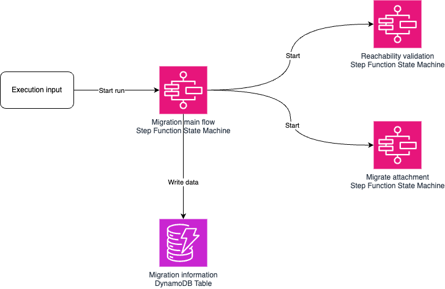
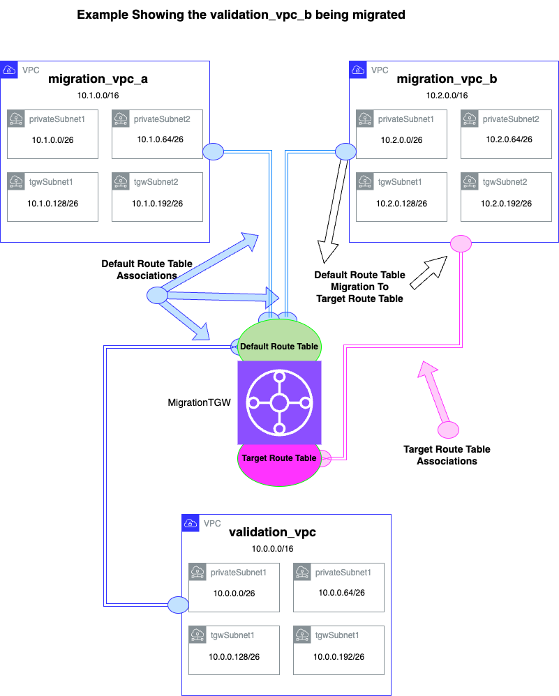
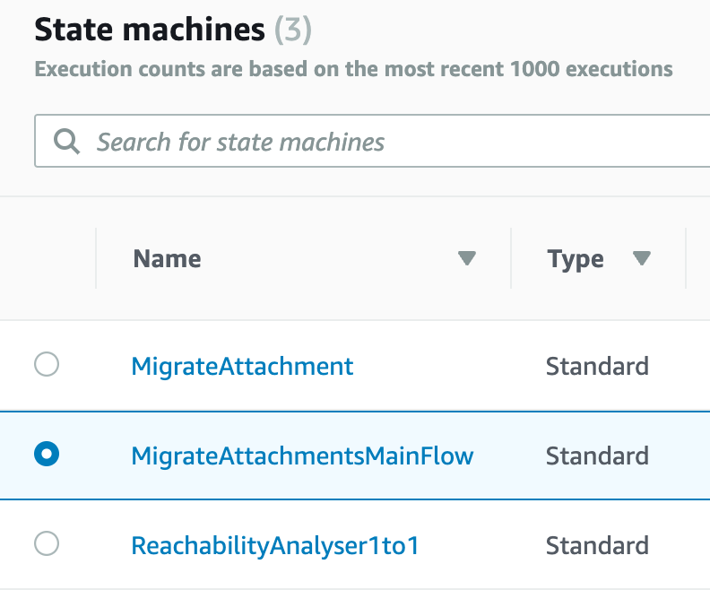
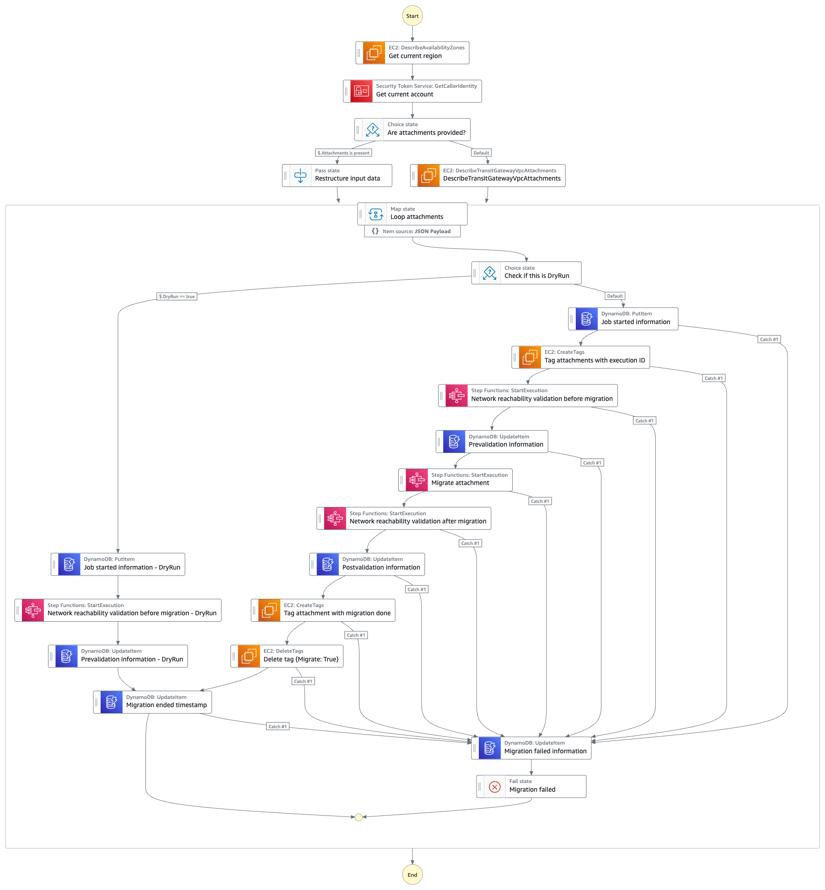
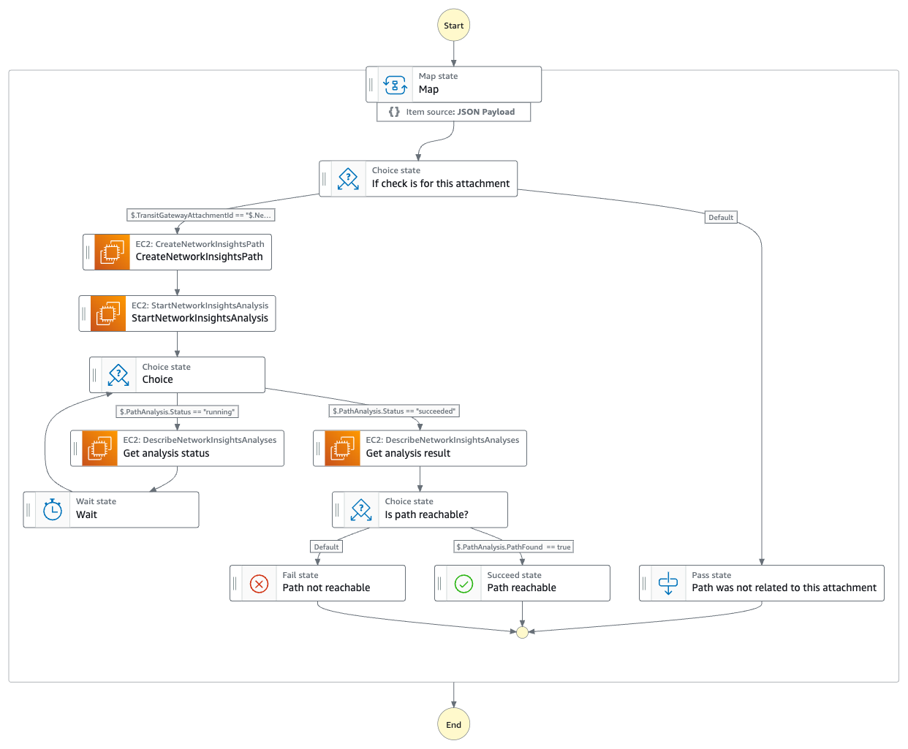
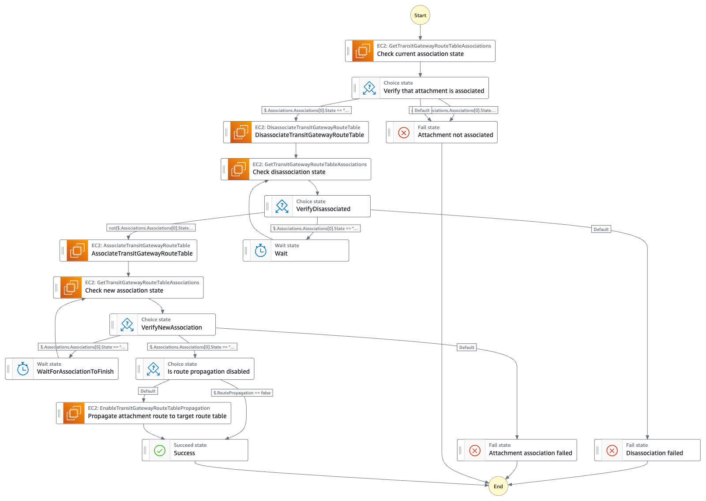

# AWS Transit Gateway Attachment migration between route tables

This repository contains CDK code to deploy a sample AWS Step Function to demononstrate Amazon VPC migrations between AWS Transit Gateway Route Tables. 

The AWS Step Function will use the AWS Reachability Analyzer API to perform pre and post migration validation to ensure the intended reachability is valid.

------

## Prerequisites

- An AWS account with an IAM user with the appropriate permissions
- Familar with an IDE or other text editiging sofware to view and edit the repo files

------

## Project

This project deploys three Amazon Step Function State Machines that together coordinate migration between AWS Transit Gateway route tables. There is one State Machine that orchestrates the migration process and that invokes other State Machines.

This solution supports both dynamic and static discovery methods for Transit Gateway Attachments that are to be migrated. If no static attachment information is spesified, attachments are searched from account by tag `Migrate:True`



## Deployment Steps

This solution consists of two CDK Stacks named MigrationStatemachineStacks and SampleEnvironmentStack.
MigrationStateMachineStack includes all four State Machines that are used to do attachment migration and the SampleEnvironmentStack includes three VPCs with instances in each of those to enable connection testing.

To deploy the solution, run `cdk deploy --all --profile <AWS profile to be used>`. 

The CDK project will deploy both the State Machines and the sample environment.

## Sample Environment




## Sample migration


After you have deployed the project to your account, navigate to Amazon Step Functions console from where you can start a migration. In Step Function console you should see three State Machines.



Open the State Machine named `MigrateAttachmentsMainFlow`. That is the State Machine that orchestrates the migration flow.

Then you can start a new execution of that State Machine. The State Machine needs input definition that speficies migration details. 

### Input parameters

* **NetworkPaths**
  * Paths that are used to verify network connectivity. If no checks are needed, provide empty array. Service behind this is Network Reachability Analyser https://docs.aws.amazon.com/vpc/latest/reachability/getting-started.html
  * Supported options with this solution are following
    * Protocol
    * Source - Either resource ID in local account or ARN for remote account
    * Destination - Either resource ID in local account or ARN for remote account
    * DestinationPort - Destination port number
    * TransitGatewayAttachmentID - Path is matched to migrated TGW attachement by this value
* **SourceRouteTableId**
  * This is the Transit Gateway Route Table that you are migrating from
* **DestinationRouteTableId**
  * This is the Transit Gateway Route Table that you are migrating to
* **DryRun**
  * Boolean value (true/false)
  * If dryrun is enabled then only pre reachability validation and documentation to DynamoDB is done but no migration.
* **RoutePropagation**
  * Boolean value (true/false)
  * If route propagation is true, then route propagation is created to the target route table. If value is false, then attachment is only migrated and you need to handle propagation.

Optional values are following

* **Attachments**
 * If you want to give attachment details manually then you can define those in following format. If you don't define attachments manually then the workflow will find those based on tags. To migrate attachment you need to tag it with `Migrate:True`


### Sample input definition

Miminum input definition. With this definition, the State Machine will be looking for Transit Gateway Attachments in your account with tag `Migrate:True` as there is no attachment information given. There are no paths defined so no Reachability checks are run.

*NOTE*: If you want to perform the migration, please change **"DryRun": true to "DryRun": false**

```
{
  "RoutePropagation": false,
  "SourceRouteTableId": "<Source Route Table Id>",
  "TargetRouteTableId": "<Target Route Tble Id>",
  "DryRun": true,
  "NetworkPaths": []
}
```

If you want to use the AWS CLI to get the required input parameters and validation, the following can be used:

Find the VPCs with the word 'migrate' in the name:

```
❯ aws ec2 describe-vpcs --output text --query 'Vpcs[*].{VpcId:VpcId,Name:Tags[?Key==`Name`].Value|[0]}' --filters Name=tag:Name,Values=*migrate*

migrate_vpc_a	vpc-07f8e749d931091f1
migrate_vpc_b	vpc-03df1a693589d11e1
```

We'll also get the VPC details of the validation_vpc as we'll need the Transit Gateway Attachment ID of this VPC later:

```
❯ aws ec2 describe-transit-gateway-vpc-attachments --output text --query 'TransitGatewayVpcAttachments[*].TransitGatewayAttachmentId|[0]' --filters  Name=tag:Name,Values=validation_vpc

tgw-attach-0b43c75f3cf1db43d
```


Check there are no current Transit Gateway VPC attachments with the Migration tag set to True

```
❯ aws ec2 describe-transit-gateway-vpc-attachments --output text --query 'TransitGatewayVpcAttachments[*].TransitGatewayAttachmentId|[0]' --filters  Name=tag:Migrate,Values=True

❯
```

You should get no returned output, there are no Transit Gateway VPC attachments marked for migration.

In the following example, we are going to migrate the VPC called migrate_vpc_b as per the sample environment diagram above:

Set the Migrate:True tag:

```
❯ migration_vpc_attachment=$(aws ec2 describe-transit-gateway-vpc-attachments --output text --query 'TransitGatewayVpcAttachments[*].TransitGatewayAttachmentId|[0]' --filters  Name=tag:Name,Values=migrate_vpc_b)

❯ echo $migration_vpc_attachment
tgw-attach-0a39b368f8c4a3ca2
```

Add the Migrate:True tag to the migration_vpc_attachment

```
❯ aws ec2 create-tags --resources ${migration_vpc_attachment} --tags Key=Migrate,Value=True
```

Validate the Migration tag has been set to True

```
❯  aws ec2 describe-transit-gateway-vpc-attachments --output text --query 'TransitGatewayVpcAttachments[*].TransitGatewayAttachmentId|[0]' --filters  Name=tag:Migrate,Values=True
tgw-attach-0a39b368f8c4a3ca2
```

Now to get the SourceRouteTableId and TargetRouteTableId, in our example the source route table is the default route table, and the target route table is named TargetRT

```
❯ aws ec2 describe-transit-gateway-route-tables  \
--query 'TransitGatewayRouteTables[?TransitGatewayId==`tgw-0ea985e52bc55144d`].{TransitGatewayId:TransitGatewayId,TransitGatewayRouteTableId:TransitGatewayRouteTableId,DefaultRT:DefaultAssociationRouteTable,RT_Name:Tags[?Key==`Name`].Value|[0]||`Default Route Table`}'

[
    {
        "TransitGatewayId": "tgw-0ea985e52bc55144d",
        "TransitGatewayRouteTableId": "tgw-rtb-0917b9c532ea67f78",
        "DefaultRT": true,
        "RT_Name": "Default Route Table"
    },
    {
        "TransitGatewayId": "tgw-0ea985e52bc55144d",
        "TransitGatewayRouteTableId": "tgw-rtb-0c034656a5ffb454c",
        "DefaultRT": false,
        "RT_Name": "TargetRT"
    }
]
```

Putting these values in the required template:

```
{
  "RoutePropagation": false,
  "SourceRouteTableId": "tgw-rtb-0917b9c532ea67f78",
  "TargetRouteTableId": "tgw-rtb-0c034656a5ffb454c",
  "DryRun": false,
  "NetworkPaths": []
}
```


Sample definition with paths for Reachability Analyser defined. You can define multiple paths and those can be related to the same Transit Gateway Attachment. With this definition, the State Machine will be looking for Transit Gateway Attachments in your account with tag `Migrate:True` as there is no attachment information given.

```
{
  "RoutePropagation": false,
  "SourceRouteTableId": "tgw-rtb-0917b9c532ea67f78",
  "TargetRouteTableId": "tgw-rtb-0b46842cf31ad8b87",
  "DryRun": true,
  "NetworkPaths": [
    {
      "Protocol": "tcp",
      "Source": "tgw-attach-0a39b368f8c4a3ca2",
      "Destination": "i-085c45c786bb43bfb",
      "DestinationPort": 443,
      "TransitGatewayAttachmentId": "tgw-attach-0a39b368f8c4a3ca2"
    },
    {
      "Protocol": "tcp",
      "Source": "tgw-attach-0b43c75f3cf1db43d",
      "Destination": "i-085c45c786bb43bfb",
      "DestinationPort": 443,
      "TransitGatewayAttachmentId": "tgw-attach-0b43c75f3cf1db43d"
    }
  ]
}
```

Sample definition with attachment information given. When attachment information is specified then the State Machine won't look for attachments with tags.

```
{
  "RoutePropagation": false,
  "SourceRouteTableId": "tgw-rtb-057b04b58c71dad3f",
  "TargetRouteTableId": "tgw-rtb-0b46842cf31ad8b87",
  "DryRun": true,
  "NetworkPaths": [
    {
      "Protocol": "tcp",
      "Source": "tgw-attach-0694084e0871aa6d7",
      "Destination": "i-085c45c786bb43bfb",
      "DestinationPort": 443,
      "TransitGatewayAttachmentId": "tgw-attach-0a39b368f8c4a3ca2"
    },
    {
      "Protocol": "tcp",
      "Source": "tgw-attach-0b43c75f3cf1db43d",
      "Destination": "i-085c45c786bb43bfb",
      "DestinationPort": 443,
      "TransitGatewayAttachmentId": "tgw-attach-0b43c75f3cf1db43d"
    }
  ],
  "Attachments": [
    {
     "TransitGatewayAttachmentId": "tgw-attach-0a39b368f8c4a3ca2",
      "VpcId": "vpc-062b20910af572b06"
    }
  ]
}

```


## State Machines

### Main Flow



### Reachability analyser flow



### Migrate attachment flow

